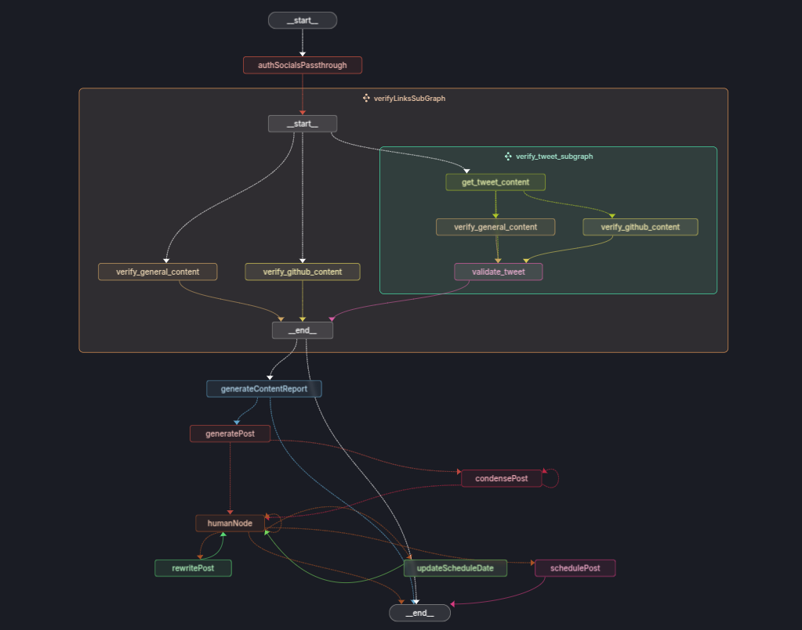
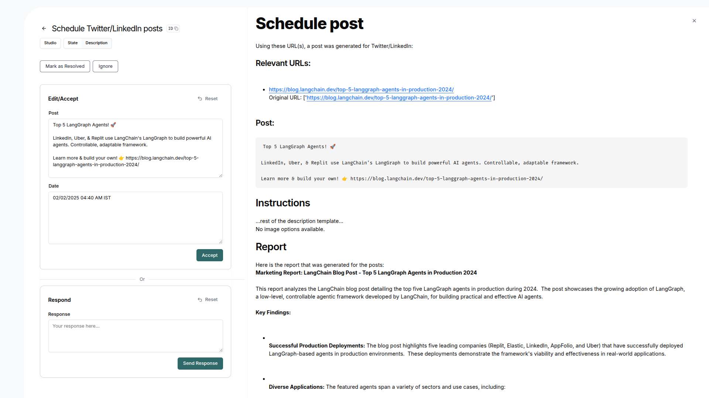

# SocialSyncAgent

# Social Media Agent 🤖

An intelligent agent that automates content curation and social media posting by processing various online sources and generating platform-specific content.This project is a Social Media Content Automation Agent that streamlines content creation and publishing across multiple platforms. The agent takes input links from various sources such as blogs, tweets, GitHub repositories, and more, scrapes relevant data, generates content reports, and creates platform-specific posts for social media.

## 📁 Repository Details

This repository contains only the README to showcase the project's functionality and potential.

The source code is not publicly available but can be demonstrated upon request.

## 🌟 Features

- **Multi-Source Content Aggregation**
  - Scrapes content from diverse sources:
    - Blog posts
    - Tweets/X posts
    - GitHub repositories
    - Other online content

- **Smart Content Processing**
  - Analyzes and synthesizes information from multiple sources
  - Generates comprehensive content reports
  - Creates platform-optimized posts automatically

- **Platform-Specific Optimization**
  - Automatically adapts content for different platforms:
    - Twitter/X (character limit compliant)
    - LinkedIn (professional formatting)
  - Maintains platform-specific tone and style

- **Human-in-the-Loop Feedback**
  - Interactive feedback system
  - Post revision capabilities
  - Content adjustment options
  - Approval workflow

- **Automated Scheduling**
  - Smart scheduling system
  - Customizable posting dates
  - Priority management
  - Schedule modification during feedback

- **Direct Social Media Integration**
  - Automated posting to connected accounts
  - Multi-platform support
  - Authentication handling

## 🔄 Workflow

1. **Input Processing**
   - User provides content source links
   - System initiates content scraping

2. **Content Analysis**
   - Data extraction from sources
   - Content synthesis and report generation

3. **Post Generation**
   - Platform-specific content creation
   - Character limit optimization
   - Tone and format adaptation

4. **Human Feedback Loop**
   - Content review
   - Revision requests
   - Schedule adjustments
   - Priority modifications
   - Final approval

5. **Automated Posting**
   - Schedule execution
   - Multi-platform distribution
   - Status monitoring

## 🏗️ Architecture

The system utilizes LangGraph Studio for workflow orchestration and AgentBox for the user interface, creating a seamless and efficient content management pipeline.

## 🔮 Future Enhancements

- Additional platform support
  - Reddit integration
  - YouTube video content processing
  - Extended social media platform coverage

- Natural Language Input Processing
  - Topic-based content generation
  - Automatic relevant source discovery
  - Custom source link addition
  - Multi-source content aggregation

- Slack Integration
  - Direct message-based post creation
  - Automated cron job scheduling
  - Link processing through Slack
  - Real-time notifications

- Enhanced Content Generation
  - Automated blog post creation
  - Multi-format content adaptation
  - SEO optimization
  - Rich media support

- Advanced Priority Management
  - Multi-level priority system
  - Topic-based prioritization
  - Time-sensitive content handling
  - Platform-specific priority queues

- Advanced scheduling algorithms
- Enhanced content analysis
- Improved personalization
- Analytics integration

## 📝 Note

This project demonstrates the capability to automate and streamline social media content management while maintaining content quality through human oversight.
